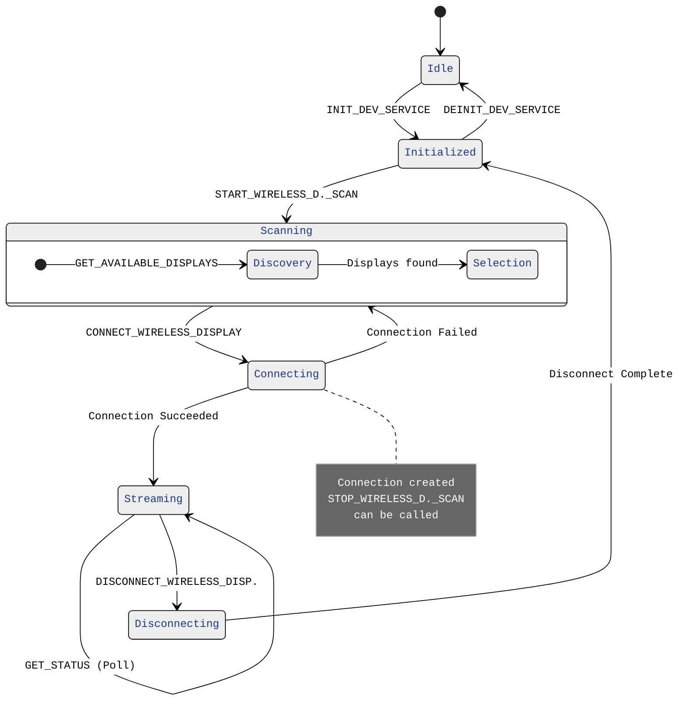

# Mastering the ZWDS Wireless Display API

Wireless display experiences live or die by their connection lifecycle. The ZWDS (Zebra Wireless Developer Service) API for ZEC500-class devices centers on a small but critical set of calls that must be orchestrated correctly to deliver a smooth “extended” secondary screen experience. This post walks through the canonical sequence, expands on each stage, and offers patterns, diagrams, and practices you can adopt immediately.

I'm providing developers with two sample projects that exercises ZWDS APIs
- The first works with APIs separately, so that you must invoke the single APIs by pressing buttons in the guided sequence. This project is found in the "all-API" module.
- The second is found in the "workflow" module and showcases the SCAN TO CONNECT usecase (a QRcode with the target display name must be scanned) and the TAP TO CONNECT usecase, where the target screen name is sourced by the target device's NFC.

---

## Security
However, before diving into the APIs and their use cases, let's examine the ZWDS security feature. We wanted to implement a robust version of the wireless developer service, so, by design, ZWDS can only be invoked by administrator-enabled devices. This is a common paradigm for several Zebra services. 

The security feature is enabled by default, meaning that unless it is intentionally disabled, any third-party app that wants to interact with the ZWDS needs to be allowed by means of the Zebra MX Access Manager.

If the app calling the ZWDS APIs has not been allowed, an _Invalid Token/Caller_ error message is returned.

To enable the service binding, let a device administrator use Stagenow like this:
- Work with an instance of the Access Manager
- Service Access Action: "Allow Binding to Service"
- Service Identifier: "delegation-zebra-zwds-api-secure-access-config"

Once the binding has been granted, any ZWDS API call must include a _token_, generated through the GetIntentSecureToken class. Refer to [`this line as an example of Token generation and application`](https://github.com/NDZL/ZEC500-ZWDS-API-EXERCISER/blob/f499f5019d94e03ec90ff9384e252d945d19132d/all-APIs/src/main/java/com/zebra/pocsampledev/MainActivity.java#L120)

---

## High-Level Lifecycle ('all-API' module) 
Here is the API set to use to interact with the ZWDS service. The numbering suggests the calling sequence. Follow the links to access the related source that you can copy/paste directly into your project. Refer to the next paragraph 'Expanded State Machine View' for a complete state diagram.

| Step | API | Purpose | Key Outputs | Common Failure Modes |
|------|-----|---------|-------------|----------------------|
| 1 | [`INIT_DEV_SERVICE`](https://github.com/NDZL/ZEC500-ZWDS-API-EXERCISER/blob/f499f5019d94e03ec90ff9384e252d945d19132d/all-APIs/src/main/java/com/zebra/pocsampledev/MainActivity.java#L102) | Bootstraps internal Zebra Wireless Developer Service objects, allocators, threads | Service/session handle | Misconfigured environment, missing permissions |
| 2 | [`START_WIRELESS_DISPLAY_SCAN`](https://github.com/NDZL/ZEC500-ZWDS-API-EXERCISER/blob/f499f5019d94e03ec90ff9384e252d945d19132d/all-APIs/src/main/java/com/zebra/pocsampledev/MainActivity.java#L131) | Searches the surrounding environment for connectable displays | --- | Radio disabled, scan already in progress |
| 3 | [`GET_AVAILABLE_DISPLAYS`](https://github.com/NDZL/ZEC500-ZWDS-API-EXERCISER/blob/f499f5019d94e03ec90ff9384e252d945d19132d/all-APIs/src/main/java/com/zebra/pocsampledev/MainActivity.java#L285) | Enumerates nearby receiver endpoints | A list of available displays and the related metadata (e.g. Device name and Address) | No actual display is available |
| 4 | [`CONNECT_WIRELESS_DISPLAY`](https://github.com/NDZL/ZEC500-ZWDS-API-EXERCISER/blob/f499f5019d94e03ec90ff9384e252d945d19132d/all-APIs/src/main/java/com/zebra/pocsampledev/MainActivity.java#L179) | Establishes transport channel to selected endpoint, among those listed at point #3 | Connection handle / state events | Timeouts, auth mismatch, target busy |
| 5 | [`STOP_WIRELESS_DISPLAY_SCAN`](https://github.com/NDZL/ZEC500-ZWDS-API-EXERCISER/blob/f499f5019d94e03ec90ff9384e252d945d19132d/all-APIs/src/main/java/com/zebra/pocsampledev/MainActivity.java#L155) | Halts discovery to reduce RF + CPU load | Scan cleared | Scan handle lost, race with connection failure |
| 6 | [`GET_STATUS`](https://github.com/NDZL/ZEC500-ZWDS-API-EXERCISER/blob/f499f5019d94e03ec90ff9384e252d945d19132d/all-APIs/src/main/java/com/zebra/pocsampledev/MainActivity.java#L259) | Optional poll connection status | Connection status flag and address are returned | Handshake failure, encryption negotiation error|
| - | User/3rd party apps consume the wireless display connection | --- | --- | Latency spikes, QoS drops |
| 7 | [`DISCONNECT_WIRELESS_DISPLAY`](https://github.com/NDZL/ZEC500-ZWDS-API-EXERCISER/blob/f499f5019d94e03ec90ff9384e252d945d19132d/all-APIs/src/main/java/com/zebra/pocsampledev/MainActivity.java#L211) | Tears down connection gracefully | Resource release | Forced disconnect, leakage on error path |
| 8 | [`DEINIT_DEV_SERVICE`](https://github.com/NDZL/ZEC500-ZWDS-API-EXERCISER/blob/f499f5019d94e03ec90ff9384e252d945d19132d/all-APIs/src/main/java/com/zebra/pocsampledev/MainActivity.java#L235) | Service is uninitialized | --- | --- |

Here is how this sample app appears when run on a Zebra ET401 tablet (OS is Android 15).

Buttons numbering on the app matches those described above.

---

## Expanded State Machine View

Below is a more explicit (including failure branch) than the provided success-only flow.
`For brevity W._D. stands for WIRELESS_DISPLAY`

The key steps to work with these APIs are summarized in the following lines:
- Initialize the service and START_WIRELESS_DISPLAY_SCAN search
- Collect the available displays by calling the GET_AVAILABLE_DISPLAYS periodically
  - Each returned item includes an available WIFI MAC ADDRESS and a DISPLAY NAME.
  - To connect to a specific display, the Connect API needs the WIFI MAC ADDRESS; however, users want to select a display by their NAME.
  - Your business logic needs to allow for a display NAME entry/scan, then you'll need to match such a NAME to its WIFI MAC ADDRESS.

   Refer to e.g. [`this ZEC500 sample code`](https://github.com/ZebraDevs/ZEC500-DEV-UG-SampleApp) to show a QRCode of the target display name. That QRCode will be scanned by the connecting app, which in turn will finally invoke the CONNECT_WIRELESS_DISPLAY API to complete the wireless connection.

- Before further proceeding, it's advised to STOP_WIRELESS_DISPLAY_SCAN, to save battery energy.
- Eventually, invoke CONNECT_WIRELESS_DISPLAY by explicitly passing the `intent.putExtra("DEVICE_ID", deviceAddress);` found above and chose by the user.
  The CONNECT_WIRELESS_DISPLAY succeeds only if the target display properties `canConnect` and `isAvailable` are both `true`
- Finally, manage the release of the above resources.

---

## Wireless Display Change Broadcasters
The additional API [`WIRELESS_DISPLAY_CALLBACK (ON)`](https://github.com/NDZL/ZEC500-ZWDS-API-EXERCISER/blob/f499f5019d94e03ec90ff9384e252d945d19132d/all-APIs/src/main/java/com/zebra/pocsampledev/MainActivity.java#L309) can optionally be used to register for receiving ZEC500 wireless display changes by the 3rd party app.

To Unregister, use [`WIRELESS_DISPLAY_CALLBACK (OFF)`](https://github.com/NDZL/ZEC500-ZWDS-API-EXERCISER/blob/f499f5019d94e03ec90ff9384e252d945d19132d/all-APIs/src/main/java/com/zebra/pocsampledev/MainActivity.java#L338)

---
## API Template

ZWDS APIs follow a common pattern that is explained in the following lines.
Let's take the `START_WIRELESS_DISPLAY_SCAN` API as an example.
Also, let's compare that API documentation with the actual code implementation 

 

- The API defines the Intent action (e.g. `new Intent("com.zebra.wirelessdeveloperservice.action.START_WIRELESS_DISPLAY_SCAN");`)
- The target package name is always `intent.setPackage(WIRELESS_DEV_SERVICE_PACKAGE);`, where `WIRELESS_DEV_SERVICE_PACKAGE = "com.zebra.wirelessdeveloperservice";`
- Then define the result that will be returned, as a pending intent and add it to the intent to be sent

  
- Manage the secure token, if needed, as explained at the beginning of this blog
   
- Finally, broadcast the intent as `sendBroadcast(intent);`

Act similarly for the other APIs.

 
## The Workflows
As shared in this blog post introduction, an additional sample project is amde available to developers. It shows how to automate all the needed API calls acoording to two workflows: TAP TO CONNECT (where NFC tapping is involved) and SCAN TO CONNECT (where a barcode scanning is required).

I'll briefly describe such workflows in the following lines.

### SCAN TO CONNECT
It's the most common use case.
Visually, this picture shows how it works

- The screen is connected to ZEC500 and runs an app that displays the QR Code (screen's bottom-right)
- A tablet (Zebra ET401) in the foreground is connecting by scanning that QR Code

The logic here requires that on the Table side a match between the scanned screen name and the available displays is found and resolved into a WIFI MAC ADDRESS. Such a matching [happens here](https://github.com/NDZL/ZEC500-ZWDS-API-EXERCISER/blob/5abbca69e4fa4496e647bdf7ea0bc5ce18603407/workflow/src/main/java/com/zebra/zwds/developersample/Utils.java#L47), and is followed by a connection attempt with `DeveloperService.connectDevice(...)`.

---

Happy building!
