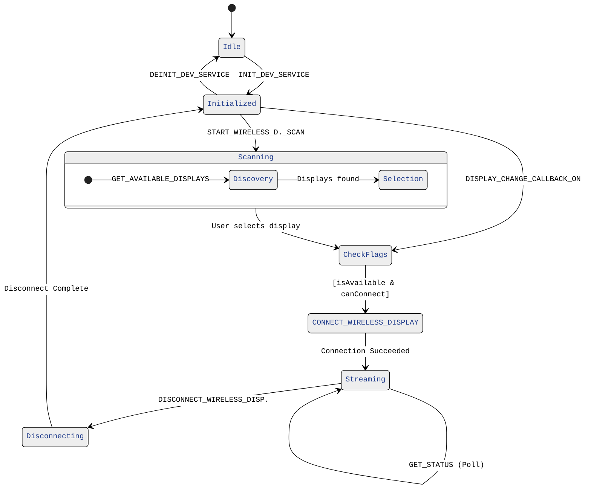

# Mastering the ZWDS Wireless Display API v20251218h7

Wireless display experiences live or die by their connection lifecycle. The ZWDS (Zebra Wireless Developer Service) API for ZEC500-class devices centers on a small but critical set of calls that must be orchestrated correctly to deliver a smooth “extended” secondary screen experience. This post walks through the canonical sequence, expands on each stage, and offers patterns, diagrams, and practices you can adopt immediately.

I'm providing developers with two sample projects that exercise ZWDS APIs
- The first works with APIs separately, so that you must invoke the single APIs by pressing buttons in the guided sequence. This project is found in the "all-API" module.
- The second is found in the "workflow" module and showcases the SCAN TO CONNECT use case (a QR code with the target display name must be scanned) and the TAP TO CONNECT use case, where the target screen name is sourced by the target device's NFC.

---

## Security
However, before diving into the APIs and their use cases, let's examine the ZWDS security feature. We wanted to implement a robust version of the wireless developer service, so, by design, ZWDS can only be invoked by administrator-enabled devices. This is a common paradigm for several Zebra services. 

### SECURE MODE

#### TOKEN USAGE
The security feature is enabled by default, meaning that unless it is intentionally disabled, any third-party app that wants to interact with the ZWDS needs to use a _token_ mechanism detailed below.

If the app calling the ZWDS APIs has not been allowed, an _Invalid Token/Caller_ error message is returned.

In secure mode, any ZWDS API call must include a _token_, generated through the GetIntentSecureToken class. Refer to [`this line as an example of Token generation and application`](https://github.com/NDZL/ZEC500-ZWDS-API-EXERCISER/blob/f499f5019d94e03ec90ff9384e252d945d19132d/all-APIs/src/main/java/com/zebra/pocsampledev/MainActivity.java#L120) and to [this code](https://github.com/NDZL/ZEC500-ZWDS-API-EXERCISER/blob/f499f5019d94e03ec90ff9384e252d945d19132d/all-APIs/src/main/java/com/zebra/pocsampledev/GetIntentSecureToken.java). Such a token generation procedure leverages the Zebra Delegation Scope mechanism, and the application using it needs to be allowed ahead of time.

For clarity, the token request/generation works by accessing a specific Content Provider, identified by the authority `content://com.zebra.devicemanager.zdmcontentprovider` and found at this URI `content://com.zebra.devicemanager.zdmcontentprovider/AcquireToken`. A query performed in this way

returns a cursor, and the token is found in the first record, under the `query_result` column, as a string type.

#### ALLOWING AN APPLICATION TO REQUEST TOKENS
However, not any application can generate a token! An administrator needs to grant the token generation permission to the intended app by means of the following Access Manager action
- Service: "Allow Caller to Call Service"
- Service Identifier: "delegation-zebra-zwds-api-intent-secure"
- Caller Package Name: this is the applicationID of the application that will be granted access to the token generation; the applicationId is usually found in the build.gradle file of an Android Studio project.
  
  e.g. 
- Caller Signature: this is the first signature of the application's APK, in DER format, provided as a CRT file. Refer to [https://techdocs.zebra.com/sigtools/](https://techdocs.zebra.com/sigtools/) to learn how to extract a signature. I also made this online application available for APK signature retrieval; it works for most APKs: [https://cxnt48.com/apksig](https://cxnt48.com/apksig)

The following picture summarizes the Access Manager configuration required:

### UNSECURE MODE
To use the ZWDS in an _unsecure mode_, just enable the service binding, e.g. through Stagenow like this:
- Work with an instance of the Access Manager
- Service Access Action: "Allow Binding to Service"
- Service Identifier: "delegation-zebra-zwds-api-secure-access-config"

While in Unsecure Mode, ZWDS APIs can be called without requiring a token.

Making a similar call with action "Disallow Binding to Service", enables the security mode.

---

## High-Level Lifecycle ('all-API' module) 
Here is the API set to use to interact with the ZWDS service. The numbering suggests the calling sequence. Follow the links to access the related source that you can copy/paste directly into your project. Refer to the next paragraph 'Expanded State Machine View' for a complete state diagram.

| Step | API | Purpose | Key Outputs | Common Failure Modes |
|------|-----|---------|-------------|----------------------|
| 1 | [`INIT_DEV_SERVICE`](https://github.com/NDZL/ZEC500-ZWDS-API-EXERCISER/blob/f499f5019d94e03ec90ff9384e252d945d19132d/all-APIs/src/main/java/com/zebra/pocsampledev/MainActivity.java#L102) | Bootstraps internal Zebra Wireless Developer Service objects, allocators, threads | Service/session handle | Misconfigured environment, missing permissions |
| 2 | [`DISPLAY CHANGE, CALLBACK ON`]() | To notify an app of any changes in its properties |  |  |
| 3 | [`START_WIRELESS_DISPLAY_SCAN`](https://github.com/NDZL/ZEC500-ZWDS-API-EXERCISER/blob/f499f5019d94e03ec90ff9384e252d945d19132d/all-APIs/src/main/java/com/zebra/pocsampledev/MainActivity.java#L131) | Searches the surrounding environment for connectable displays | --- | Radio disabled, scan already in progress |
| 4 | [`GET_AVAILABLE_DISPLAYS`](https://github.com/NDZL/ZEC500-ZWDS-API-EXERCISER/blob/f499f5019d94e03ec90ff9384e252d945d19132d/all-APIs/src/main/java/com/zebra/pocsampledev/MainActivity.java#L285) | Enumerates nearby receiver endpoints | A list of available displays and the related metadata (e.g. Device name and Address) | No actual display is available |
| 5 | [`CONNECT_WIRELESS_DISPLAY`](https://github.com/NDZL/ZEC500-ZWDS-API-EXERCISER/blob/f499f5019d94e03ec90ff9384e252d945d19132d/all-APIs/src/main/java/com/zebra/pocsampledev/MainActivity.java#L179) | Establishes transport channel to selected endpoint, among those listed at point #3 | Connection handle / state events | Timeouts, auth mismatch, target busy |
| 6 | [`STOP_WIRELESS_DISPLAY_SCAN`](https://github.com/NDZL/ZEC500-ZWDS-API-EXERCISER/blob/f499f5019d94e03ec90ff9384e252d945d19132d/all-APIs/src/main/java/com/zebra/pocsampledev/MainActivity.java#L155) | Halts discovery to reduce RF + CPU load | Scan cleared | Scan handle lost, race with connection failure |
| 7 | [`GET_STATUS`](https://github.com/NDZL/ZEC500-ZWDS-API-EXERCISER/blob/f499f5019d94e03ec90ff9384e252d945d19132d/all-APIs/src/main/java/com/zebra/pocsampledev/MainActivity.java#L259) | Optional poll connection status | Connection status flag and address are returned | Handshake failure, encryption negotiation error|
| - | User/3rd party apps consume the wireless display connection | --- | --- | Latency spikes, QoS drops |
| 8 | [`DISCONNECT_WIRELESS_DISPLAY`](https://github.com/NDZL/ZEC500-ZWDS-API-EXERCISER/blob/f499f5019d94e03ec90ff9384e252d945d19132d/all-APIs/src/main/java/com/zebra/pocsampledev/MainActivity.java#L211) | Tears down connection gracefully | Resource release | Forced disconnect, leakage on error path |
| 9 | [`DISPLAY CHANGE, CALLBACK OFF`]() | Releases the callback mechanims | --- |  |
| 10 | [`DEINIT_DEV_SERVICE`](https://github.com/NDZL/ZEC500-ZWDS-API-EXERCISER/blob/f499f5019d94e03ec90ff9384e252d945d19132d/all-APIs/src/main/java/com/zebra/pocsampledev/MainActivity.java#L235) | Service is uninitialized | --- | --- |

Here is how this sample app appears when run on a Zebra ET401 tablet (OS is Android 15).

The buttons numbered on the app match those described above.

---

## Expanded State Machine View

Below is a more explicit than the provided success-only flow.
`For brevity W._D. stands for WIRELESS_DISPLAY`

The key steps to work with these APIs are summarized in the following lines:
- Initialize the service and enable the DISPLAY CHANGE CALLBACK. Callbacks are useful to detect changes in the display properties such as availability and connectability.
- Then START_WIRELESS_DISPLAY_SCAN search
- Collect the available displays by calling the GET_AVAILABLE_DISPLAYS periodically
  - Each returned item includes an available WIFI MAC ADDRESS and a DISPLAY NAME.
  - To connect to a specific display, the Connect API needs the WIFI MAC ADDRESS; however, users want to select a display by their NAME.
  - Your business logic needs to allow for a display NAME entry/scan, then you'll need to match such a NAME to its WIFI MAC ADDRESS.

  - Then refer to e.g. [`this ZEC500 sample code`](https://github.com/ZebraDevs/ZEC500-DEV-UG-SampleApp) to show a QRCode of the target display name. That QRCode will be scanned by the connecting app, which in turn will finally invoke the CONNECT_WIRELESS_DISPLAY API to complete the wireless connection.

- Before further proceeding, it's advised to STOP_WIRELESS_DISPLAY_SCAN, to save battery energy
- Also, wait for the callback to signal that `isAvailable==true` and `canConnect==true` 
- Eventually, invoke CONNECT_WIRELESS_DISPLAY by explicitly passing the `intent.putExtra("DEVICE_ID", deviceAddress);` found above and chose by the user.
  The CONNECT_WIRELESS_DISPLAY succeeds only if the target display properties `canConnect` and `isAvailable` are both `true`
- Finally, manage the release of the above resources.

---
## API Template

ZWDS APIs follow a common pattern that is explained in the following lines.
Let's take the `START_WIRELESS_DISPLAY_SCAN` API as an example.
Also, let's compare that API documentation with the actual code implementation 

 

- The API defines the Intent action (e.g. `new Intent("com.zebra.wirelessdeveloperservice.action.START_WIRELESS_DISPLAY_SCAN");`)
- The target package name is always `intent.setPackage(WIRELESS_DEV_SERVICE_PACKAGE);`, where `WIRELESS_DEV_SERVICE_PACKAGE = "com.zebra.wirelessdeveloperservice";`
- Then define the result that will be returned, as a pending intent and add it to the intent to be sent

  
- Manage the secure token, if needed, as explained at the beginning of this blog
   
- Finally, broadcast the intent as `sendBroadcast(intent);`

Act similarly for the other APIs.

 
## The Workflows (code module 'workflow')
As shared in this blog post's introduction, an additional sample project is made available to developers. It shows how to automate all the needed API calls according to two workflows: TAP TO CONNECT (where NFC tapping is involved) and SCAN TO CONNECT (where a barcode scanning is required).

I'll briefly describe such workflows in the following paragraphs.

### SCAN TO CONNECT
It's the most common use case.
Visually, this picture shows how it works

- The screen is connected to ZEC500 and runs an app that displays the QR Code (screen's bottom-right)
- A tablet (Zebra ET401) in the foreground is connecting by scanning that QR Code

The logic here requires that on the tablet side a match between the scanned screen name and the available displays is found and resolved into a WIFI MAC ADDRESS. Such a matching [happens here](https://github.com/NDZL/ZEC500-ZWDS-API-EXERCISER/blob/5abbca69e4fa4496e647bdf7ea0bc5ce18603407/workflow/src/main/java/com/zebra/zwds/developersample/Utils.java#L47), and is followed by a connection attempt with `DeveloperService.connectDevice(...)`.

Previously, the ZWDS was initiated in the Home Activity/initializeView() method, and the display scan was performed upon entering the SCAN TO CONNECT activity in 
ScanConnectActivity.java/onCreate/DeveloperService.startDisplayScan()

### TAP TO CONNECT
This use case is based on NFC tapping. On tablets the NFC antenna in located in the middle of the screen glass. So _tapping_ results in a rather weird action like this...

The TapConnectActivity.java file controls the NFC action and the onTagDiscovered callback assigns the `targetDockName = new String(payload, StandardCharsets.UTF_8);` the program flow is then merged into the calls previoulsy described for other use cases.

---

## Best practices 

Before calling the CONNECT API, always check the ZEC500 display properties. The properties “CanConnect” and “IsAvailable” should be true to call the connect API to function and establish the connection of host with the ZEC500 Display. 

Also, before calling the CONNECT API, make sure to call the “Start Scan” first, then call “Stop Scan” after establishing the connection, to minimize the resource usage. 

While exiting from the app, make sure to call the “DEINIT_DEV_SERVICE” API to clear the ZWDS. Otherwise, it will not be possible to other apps to call “INIT_DEV_SERVICE” successfully. 

---

## Known Behavior 

If the device is kept in idle mode for a longer time (more than 1 hr), ZWDS Api calls may not work as expected. It is needed disable and reenable the wi-fi as a workaround.

Calling the “DEINIT_DEV_SERVICE” API does not disconnect the existing connection session. If it is needed to disconnect the session, call the disconnect API before calling the “DEINIT_DEV_SERVICE” API. 

If ZWDS runs in non-secure mode, it will not validate any token sent by the calling app and will not show any error messages related to secure tokens. 

Once a connection is established with the ZEC500 device, if it is again called, the API Connect. It will disconnect the existing connection. 

---

Enjoy this new ZEC500 experience!

